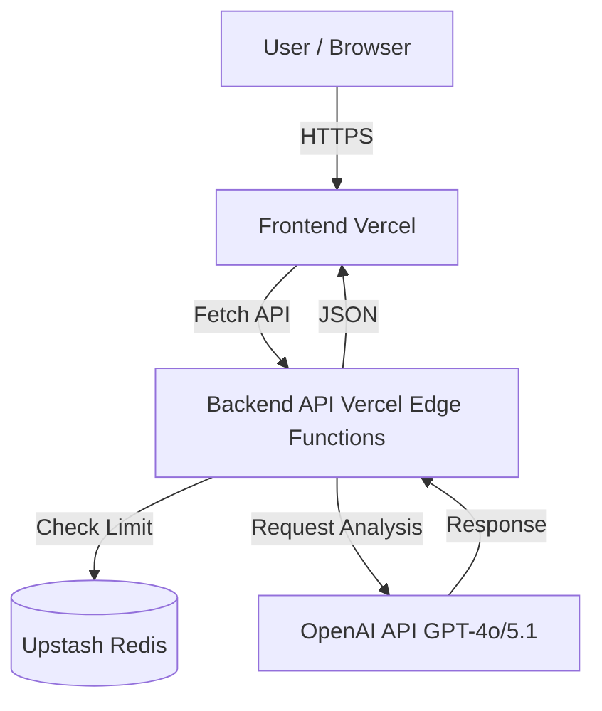

# MAGI System - AI Consensus Review

This project implements a "MAGI-style" AI review system where three distinct AI personas (Melchior, Balthasar, Casper) discuss and analyze a given topic to reach a consensus.

## Features

- **Three Unique AI Personas**:
  - **MELCHIOR-1**: Scientist / Logical (Reasoning focused)
  - **BALTHASAR-2**: Mother / Protective (Safety/Ethics focused)
  - **CASPER-3**: Woman / Intuitive (Practical/Human focused)
- **Visual Interface**: Cyberpunk/Neon aesthetic inspired by the MAGI system interface.
- **Consensus Mechanism**: The system aggregates the decisions from all three cores to determine a final "GRANTED" or "DENIED" result.
- **Serverless Architecture**: Backend logic runs on Vercel Edge Functions.
- **Security**: Rate limiting (Upstash Redis) and secure API handling.

## Tech Stack

- **Frontend**: HTML5, CSS3, Vanilla JavaScript
- **Backend**: Vercel Edge Functions (Node.js)
- **AI**: OpenAI API (GPT-4o/GPT-5.1)
- **Database**: Upstash Redis (for Rate Limiting)

## System Architecture



## Local Development

1. **Clone the repository**
   ```bash
   git clone <repository-url>
   cd magi-system
   ```

2. **Install Vercel CLI**
   ```bash
   npm i -g vercel
   ```

3. **Setup Environment Variables**
   Create a `.env.local` file in the root directory with the following variables:
   ```env
   OPENAI_API_KEY=your_openai_api_key
   UPSTASH_REDIS_REST_URL=your_upstash_url
   UPSTASH_REDIS_REST_TOKEN=your_upstash_token
   ```

4. **Run Locally**
   ```bash
   vercel dev
   ```
   Access the application at `http://localhost:3000`.

## Deployment to Vercel

This project is designed to be deployed on [Vercel](https://vercel.com).

### Option 1: Vercel CLI

1. Run the deploy command:
   ```bash
   vercel
   ```
2. Follow the prompts to link the project and set up the environment variables.

### Option 2: Vercel Dashboard (Git Integration)

1. Push your code to a Git repository (GitHub, GitLab, Bitbucket).
2. Import the project in Vercel.
3. In the "Environment Variables" section, add:
   - `OPENAI_API_KEY`
   - `UPSTASH_REDIS_REST_URL`
   - `UPSTASH_REDIS_REST_TOKEN`
4. Click **Deploy**.

## Environment Variables

| Variable | Description | Required |
|----------|-------------|----------|
| `OPENAI_API_KEY` | API Key for OpenAI | Yes |
| `UPSTASH_REDIS_REST_URL` | URL for Upstash Redis (Rate Limiting) | Yes |
| `UPSTASH_REDIS_REST_TOKEN` | Token for Upstash Redis | Yes |
| `ALLOWED_ORIGINS` | Comma-separated list of allowed origins for CORS | No (Default: localhost) |

## License

[MIT License](LICENSE)
